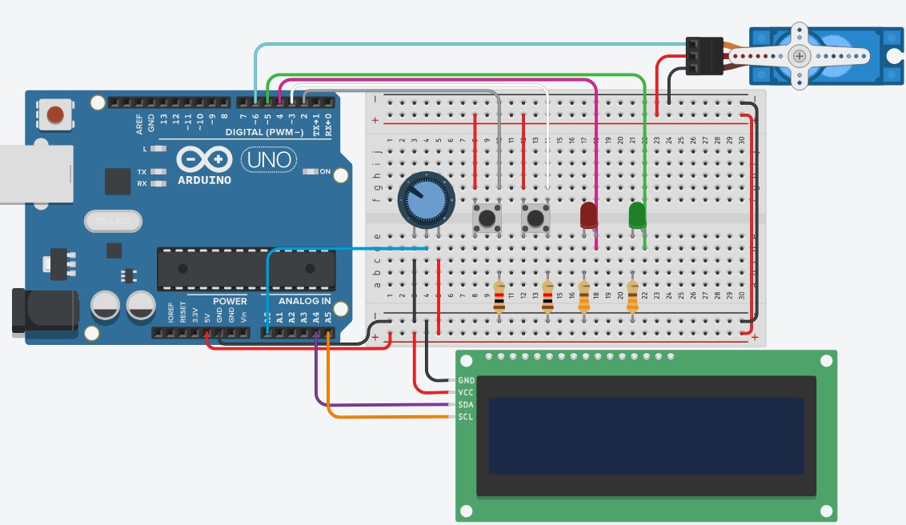

# Arduino Electronic Safe

Arduino-based electronic safe simulation developed to control access using a numeric password system, an LCD display, a potentiometer, push buttons, LEDs and a servo motor.

The potentiometer is used as a numeric selector, allowing the user to choose digits from 0 to 9. The buttons are used to confirm or reset the password input. The LCD display shows the password entry status, while the servo motor simulates the safe lock mechanism. Green and red LEDs indicate whether the entered password is correct or incorrect.

## Features

* Numeric password input system
* Potentiometer used as a digit selector
* Button to confirm each selected digit
* Button to reset the password input
* LCD display showing password entry status
* Servo motor used to simulate the lock mechanism
* Green LED for correct password
* Red LED for incorrect password
* Arduino circuit simulation

## Technologies

* Arduino
* Arduino C/C++
* LCD I2C Display
* Servo Motor
* Potentiometer
* Push Buttons
* LEDs
* Embedded Systems

## Circuit



## How it works

The system simulates an electronic safe controlled by a four-digit password.

The potentiometer works as a numeric selector, allowing the user to select a digit between 0 and 9. After selecting the desired number, the user presses the confirm button to store that digit. This process is repeated until all four digits are entered.

If the entered password is correct, the green LED turns on and the servo motor moves to the unlocked position. If the password is incorrect, the red LED turns on and the servo motor remains in the locked position.

The reset button clears the current password input, turns off the LEDs and returns the servo motor to the locked position.

## Default password

```text
0902
```

## How to run

1. Open the project in the Arduino IDE or Tinkercad.
2. Make sure the circuit is connected according to the diagram.
3. Upload or run the code.
4. Use the potentiometer to select each digit.
5. Press the confirm button to save each digit.
6. After four digits, the system checks the password.
7. Use the reset button to clear the input and restart the system.

## About the project

This project was developed as a practical electronics and embedded systems exercise, applying concepts of analog input, digital input, digital output, LCD communication, password validation and servo motor control.
